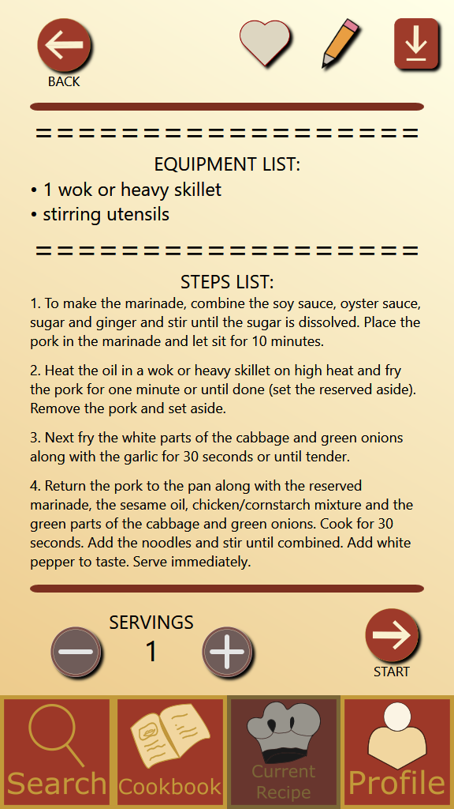

# Cookbook
C#/WPF/XAML prototype of a cooking instructor application, with the purpose of assisting people with learning, preparing, and cooking a recipe. The interface was designed and implemented by following the Task-Centered System Design (TCSD) methodology. It was originally developed as the fall 2018 term long group project for CPSC 481 (Human-Computer Interaction I) at the University of Calgary. Our group consisted of five students.

---

### Screenshots

---
